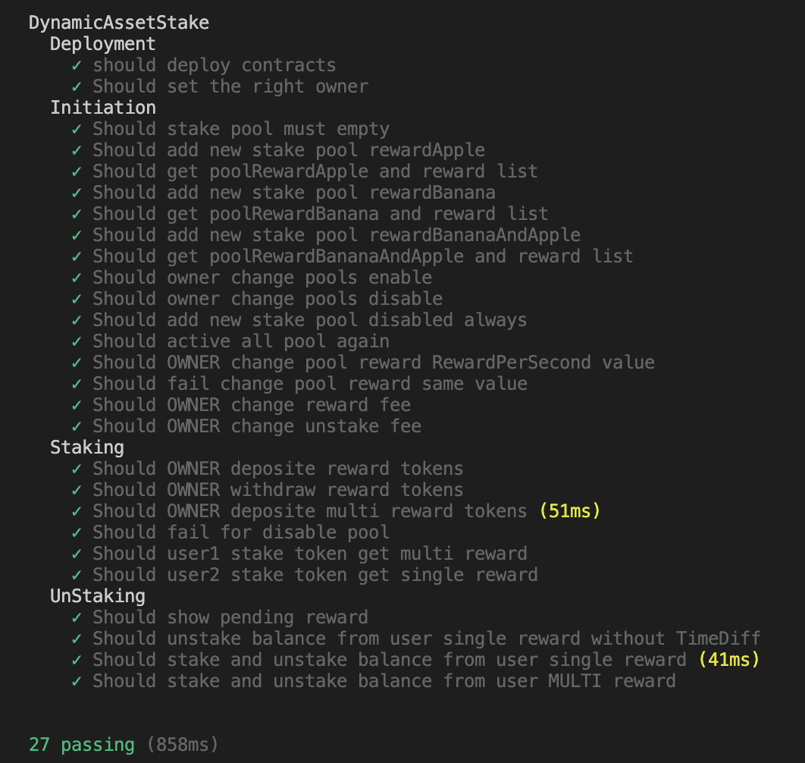
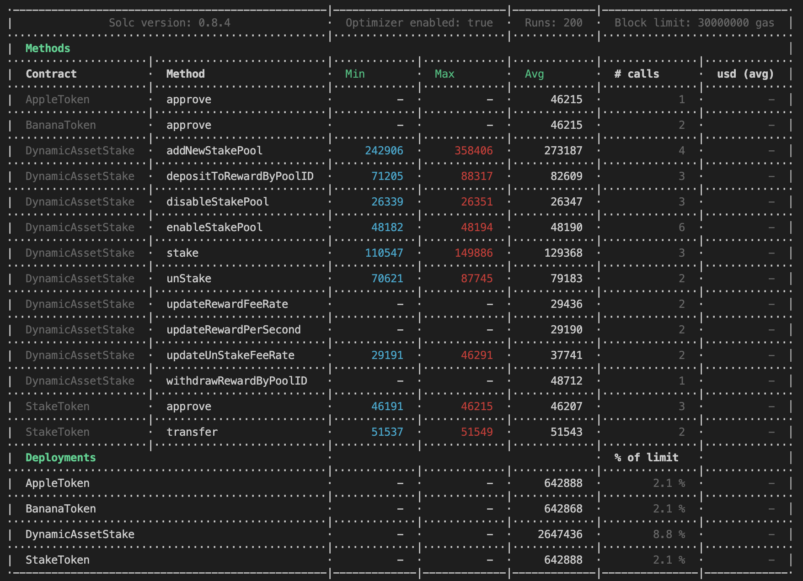

# solidity-inheritable-dynamic-asset-stake
Solidity Inheritable Dynamic Asset Stake

Reward tokens to be distributed to the stakers must be deposited into the contract.

# Getting Started

```
npm install
cp .env.sample .env
npx hardhat compile
```

# Stake Pool Relationship


# Run test information


# Estimated GAS Amounts based on run test information




# Contract user manual
- TBA


# TODO
- Min. and Max. stake oppurtunity
- Multi Storage support
- Pool expiryTime
- Emergancy Withdraws
