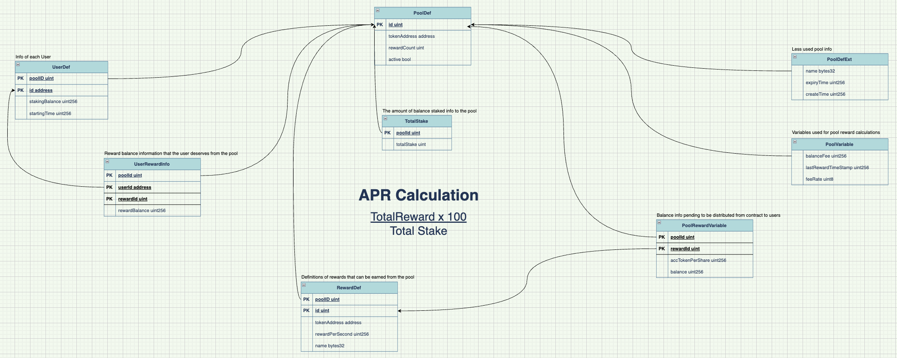

# solidity-inheritable-dynamic-asset-stake
Solidity Inheritable Dynamic Asset Stake

Reward tokens to be distributed to the stakers must be deposited into the contract.

# Stake Pool Relationship

# Installation steps
- addNewStakePool via reward list

- update bool balance info

# TODO
- Min. and Max. stake oppurtunity
- Multi Storage support
- Pool expiryTime
- Emergancy Withdraws
